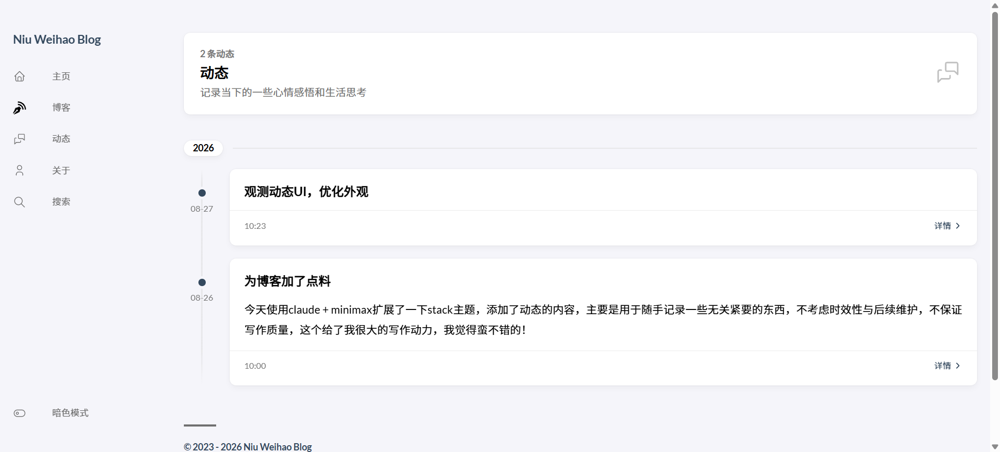

+++
date = '2026-08-27T10:23:35+08:00'
draft = false
title = '观测动态UI，优化外观'
description = "牛伟豪的动态"
keywords = ["牛伟豪","动态"]
+++

没错，今天我优化了博客的动态表现，的确变得更好看了，而且这只是我给claude的一句提示词就完成了，它提供了三个风格和一些改进建议供我选择，我觉得最终效果还可以，无bug报错，挺好。
效果图：  
效果图贴出来之后，图片失去了自适应效果，再经过一轮对话，成功修复,使用hugo自带的面包页资源进行管理图片，实现图片的自适应，目前我又发现了一个小bug，就是切换黑暗模式之后文字仍为黑色，失去了主题原有的文字变白效果，又经过一轮修复好了，现在这个主题效果已经扩展了stack很多，我觉得通过AI构造一个主题会很容易。