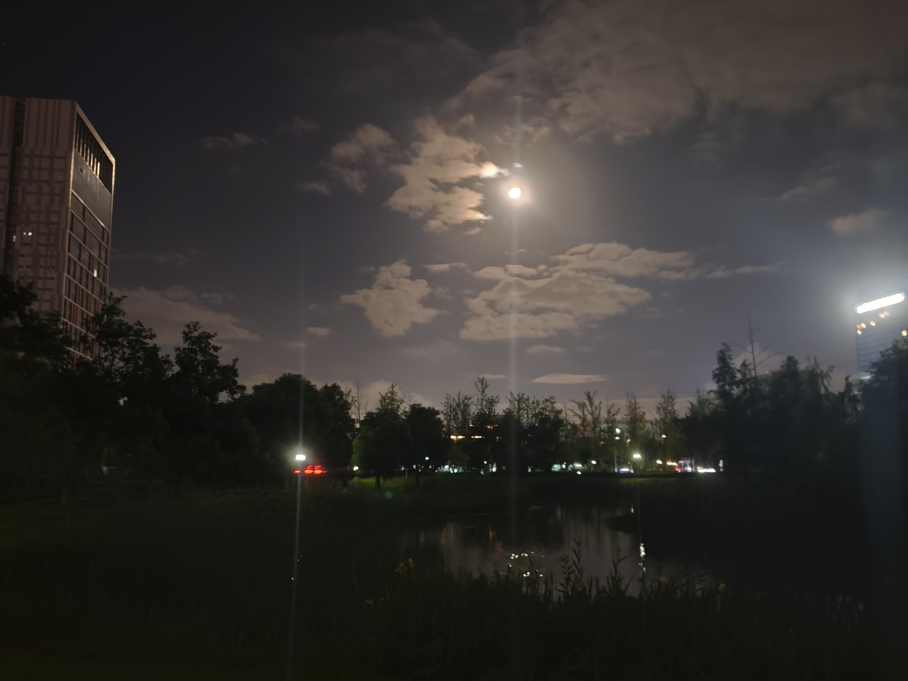
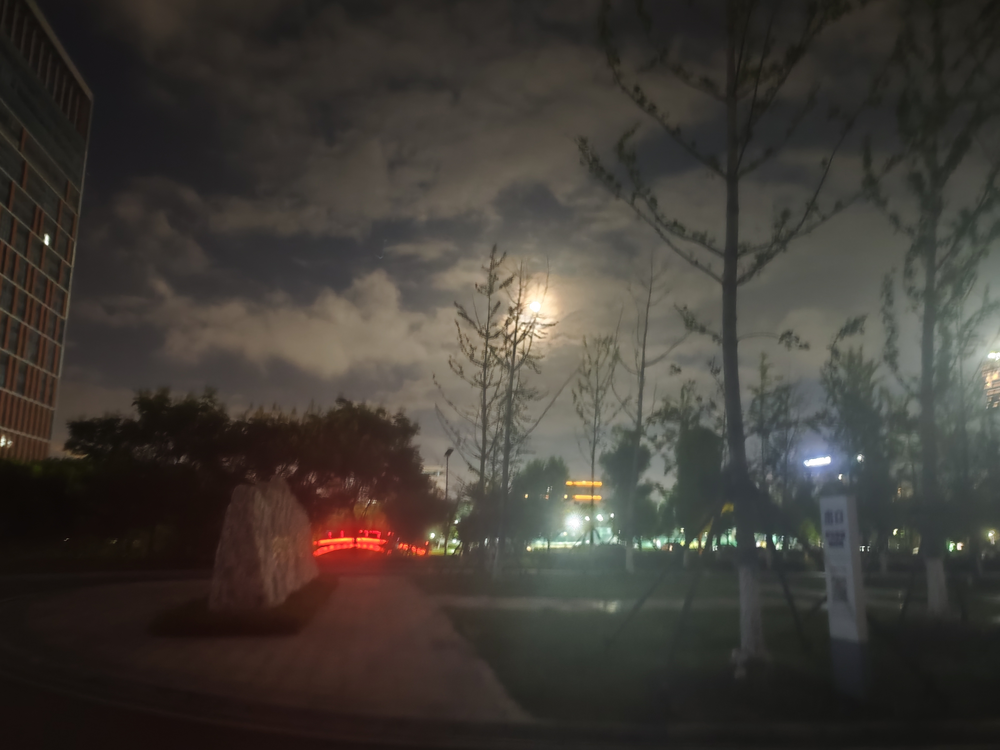

+++
title = "博客更新，昨日感想"
date = "2026-08-30T12:40:00+08:00"
draft = false
+++
  
  

这是昨天在研究院的小公园里散步时候拍的照片，我很想记录下这一时刻，但是想到还有回去打开电脑，上传手机图片到电脑来写，记录的欲望就会少很多，于是我开始想有没有什么能直接在手机上就可以直接创作的方法，没想到还真有一个叫做dcap-cms的开源项目，为hugo这类博客提供了/admin的后台管理页面，核心逻辑是可视化的与github连接，使用正常的UI界面编辑上传照片，dcap-cms负责执行git命令来更新仓库，随后cloudflare自动执行hugo产出/public页面部署，这个工作流流畅至极，但是我在想自己的动态分享了很多生活化类的东西暴漏在互联网上，后续可能会对动态做一些权限管理。  

昨天晚上其实在想自己到底有多少空闲时间，一个人漫无目的的被时间推着，被手机/抖音，游戏裹挟，就算吃饭也要同时获取一些毫无意义的内容灌输，真正思考的时间，放松的时间，专注自己的时间变得尤为稀缺。把自己的事情搞好，生活里的一团糟永远不会无缘无故消失，必须要自己去处理，这其实是有意义的，比打游戏有意义多了。记录到此为止。  

这实际上是我昨天晚上（2026-8-29）的感想，不过昨天晚上一直在搞这个dcap-cms的配置，踩了很多坑，最后使用了claud + 网上的[一些攻略](https://www.ixam.net/zh-hans/blog/2025/08/blog-made-by-hugo-github-dcapcms-cloudflarepages/)最终完成了配置，可以参考。
